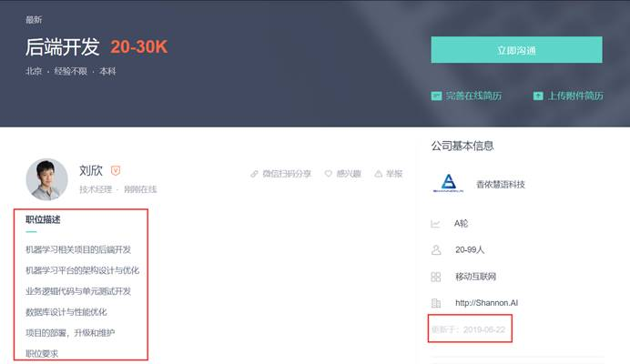

# get_zhipin_spider：

使用scrapy库与BeautifulSoup库完成了爬虫的基本实现

scrapy：


scrapy库是一个爬虫框架，对于开发者来说比较重要的是编写详细的爬取逻辑，其性能好，稳定性强，相对成熟，但可定制化较差。较适合针对网站级系列页面进行爬取。

request：

request库主要用于发起HTTP请求的函数库，可定制性较强，但其性能堪忧，实测爬取一个网页大概有1-2s延迟，其他功能非常简单，适用于单一网页的爬取。

优点：scrapy框架实现的爬虫性能好，速度快，BeautifulSoup对页面的解析能力强，可扩展性好

缺点：目前可以短时间内获取少量数据，但无法长期稳定运行，主要原因是商业网站反爬机制完善

## 已具备：

1）需要进一步优化反反爬策略

①通过建立IP池，user-agent池，cookie池

②合理设置随机的休眠时间，模拟人类访问

③测试网站反爬触发机制，定制性优化反反爬策略

## 待优化：

1）进一步完善数据库设计，考虑使用nosql

2）可以考虑做人机交互界面，增加易用性

3）根据数据库所学日志管理相关知识，可以建立爬虫的日志系统，实现断点续爬

4）可以运用多线程，进一步增强爬虫性能

# 爬取思路设计：

① 在网站主页上爬取技术大分类下各个技术方向关键词所对应的请求参数


 ② 在网站主页上爬取各个就业城市关键词所对应的请求参数。


 ③ 利用技术方向关键词的请求参数与就业城市关键词的请求参数及页码和网站基址拼接成需要爬取的网页列表。


④ 爬取网页中职位列表的基础信息，及详情链接。


 ⑤ 深入详情链接爬取详细职位信息。



 

⑥ 存储数据。

# 数据结构设计：

具体实例：

```json
{
'jobName': '后端开发工程师', 
'salary': '15-30K', 
'city': '北京 朝阳区 团结湖', 
'workYear': '经验不限', 
'education': '本科', 
'companyShortName': '闪银奇异', 
'techDirection': '后端开发', 
'financeStage': 'D轮及以上', 
'companySize': '1000-9999人', 
'jobDetail': '岗位描述：1、参与 /负责对上亿用户的行为分析，研发数据分析平台等 2、参与设计系统技术方案，核心代码开发和系统调优； 3、参与制定代码规范、测试规范，建立起开发质量控制方法； 4、协助团队攻克各种高并发、系统解耦等方面的技术难关； 5、参与各专项技术调研，新技术引入等前瞻项目；6、参与机器学习与高性能计算系统研发。 岗位要求：1、本科及以上学历，计算机相关专业； 2、热爱计算机科学和互联网技术，精通至少一门编程语言，包括但不仅限于：Java、C、C++、PHP、 Python、Go； 3、掌握扎实的计算机基础知识，深入理解数据结构、算法和操作系统知识；4、有优秀的逻辑分析能力，能够对业务逻辑进行合理的抽象和拆分；5、有强烈的求知欲，优秀的学习和沟通能力。',
'postTime': '更新于：2019-06-16'
}
```

